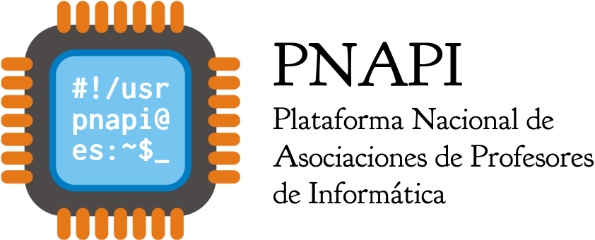

# Asociaciones

Las asociaciones del profesores de informática, algunas de las cuales disponen de sitio web propio, son:

* [Asociación de Profesores de Informática de la Comunidad Valenciana (APICV)](http://www.apicv.es/)
* [Asociación Andaluza de Profesores de Informática (AAPRI)](http://www.aapri.es/)
* [Asociación de Profesores de Informática de Aragón](http://www.apiaragon.com/)
* Asociación de Profesores de Informática de Extremadura
* Asociación de Profesores de Informática de la Comunidad de Canarias (APICC)
* Asociación de Profesores de Informática de Cantabria (APIC)
* [Asociación de Profesores de Informática de Castilla-La Mancha](http://www.arpicm.org/)
* [Asociación Profesores Informática de Madrid](http://www.apimadrid.org/)
* [Associació de Professors d’Informàtica de les Illes Balears](http://www.asbaprin.org/)
* Asociación Regional Murciana de Profesores de Informática (ARMPI)
* Asociación de Profesores deInformática de Galicia
* Asociación de Profesores de Informática de Asturias
* Asociación de Profesores de Informática de Castilla y León
* Profesores de Informática de Cataluña
* Asociación de Profesores de Informática de Murcia
* Asociación de Profesores de Informática de La Rioja
* Asociación de Profesores de Informática de Navarra
* Asociación de Profesores de Informática de Ceuta y Melilla

# II Congreso Nacional (2014)

Los días 9 y 10 de mayo de 2014 se celebró en Valencia el II congreso nacional de profesores de informática organizado por la [Asociación de Profesores de Informática de la Comunidad Valenciana (APICV)](http://www.apicv.es/)

Las sedes del congreso fueron:

* 9 de mayo: [Centro Cultural La Beneficencia](http://www.valencia.es/ayuntamiento/infociudad_accesible.nsf/vDocumentosWebListado/8CBD998D7BDFE96BC12572C20023FDA1?OpenDocument&bdOrigen=ayuntamiento)
* 10 de mayo: [Escola Tècnica Superior d'Enginyeria - Universitat de València (ETSE-UV)](http://www.uv.es/etse/) en el Campus de Burjassot

Los temas principales del congreso fueron:

* El pensamiento computacional
* La LOMCE y la Informática
* Novedades y experiencias en Formación Profesional
 
Puedes visitar [la web del congreso](http://congreso.profesoresinformatica.es/)
